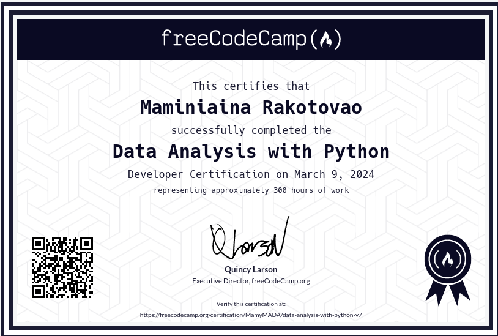

## Data Analysis with Python

I have successfully completed the [Data Analysis with Python](https://www.freecodecamp.org/learn/data-analysis-with-python/) certification from [FreeCodeCamp](https://www.freecodecamp.org/). This certification covers a wide range of topics, including data cleaning, data reading, visualization, and analysis.

Original certificate [here](https://www.freecodecamp.org/certification/MamyMADA/data-analysis-with-python-v7)
