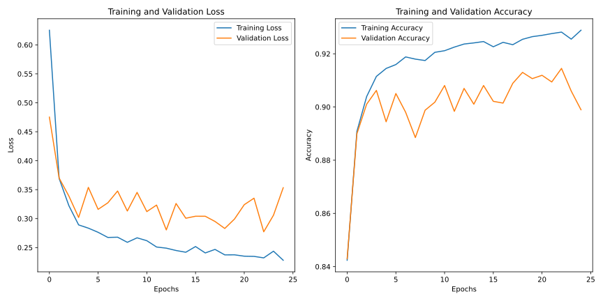

# Green Turtle Behavior Classification with 1D VNet

This project implements a 1D VNet architecture in Keras to classify the behaviors of green turtles using acceleration data. It was developed as part of a Deep Learning for Ecology course assignment. 

## Functionality

* This code takes 1D acceleration data from green turtles as input.
* It utilizes a 1D VNet model to classify different turtle behaviors based on the acceleration patterns.
* The model is built using the Keras deep learning library with TensorFlow backend.

## Getting Started

**Prerequisites:**

* Ensure you have Python (3.x recommended), TensorFlow, and Keras installed.

**Data Source:**

The acceleration data used in this project was provided by our lecturer, Lorène Jeantet. If you wish to reproduce the experiments or explore the data further, please reach out to her for access.

**Evaluation:**

1. Evaluate the model's performance on a separate test dataset.

2. During model training, the loss and accuracy of the model on the training data were tracked. Below is a subplot illustrating the changes in training loss and accuracy over epochs.

## Future Work

* Explore techniques for data preprocessing and augmentation.
* Experiment with different hyperparameter configurations for the 1D VNet model.
* Integrate the model into a larger ecological analysis pipeline.

**Note:** This is a basic implementation for educational purposes. It might require further customization for real-world applications.

**Feel free to reach out with any questions!**

