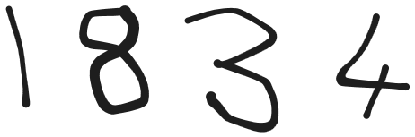

# Handwritten Digit Recognition and Multi-Digit Classification

This project uses PyTorch to build and train a neural network for multi-digit recognition using the MNIST dataset.

	

**Model Prediction Result:** ``1834``

## Introduction
Classifying MNIST data is the 'Hello, World!' in computer vision—an introductory task known for its simplicity. Going beyond this, I've implemented multi-digit classification using `PyTorch` and `OpenCV`. This project trains a neural network on the MNIST dataset, a benchmark collection of handwritten digits. The trained model excels in classifying multi-digit images, showcasing its ability to decipher and identify numerical characters present in the input image.

# Part I: MNIST dataset classification
### Neural Network Model

The `create_model` function defines a simple neural network architecture. The model consists of three linear layers:

1. Input Layer: Takes an input tensor of size `input_size`.
2. First Hidden Layer: Applies a linear transformation with ReLU activation, mapping to `hidden_dim1` dimensions.
3. Second Hidden Layer: Another linear layer with ReLU activation, mapping to `hidden_dim2` dimensions.
4. Output Layer: Final linear layer mapping to `output_size` dimensions, followed by a LogSoftmax activation along the class dimension (`dim=1`).

This architecture is suitable for classification tasks, particularly for datasets like MNIST, where the goal is to classify images of handwritten digits into one of multiple classes.

# Part II: Multi-Digit Classification

## Steps

#### Image Preprocessing
- Convert the input image to grayscale.
- Increase digit thickness using dilation and edge detection.

#### Digit Segmentation
- Detect contours and segment individual digits.
- Visualize the segmented digits with rectangles.

#### Border Addition
- Add borders to segmented digits, inspired by the MNIST dataset.

#### Image Resizing
- Resize the extracted numbers to fit the model's input size (28x28 pixels).

#### Model Prediction
- Utilize a pre-trained PyTorch model to predict the digit in each resized image.

## Libraries

To accomplish the project, I used:

- 
- 
- 
- 

## Tags
- PyTorch
- OpenCV
- MNIST
- Neural Network
- Image Classification
- Handwritten Digit Recognition
- Multi-Digit Classification
- Computer Vision
- Deep Learning
- Image Processing
- Data Preprocessing
- Contour Detection
- Model Training
- Matplotlib
- Numpy
